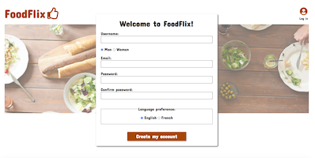
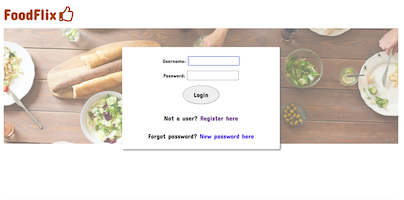
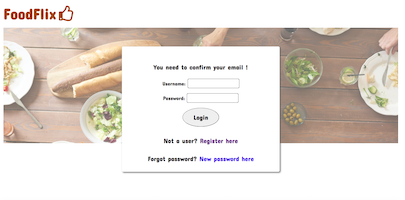
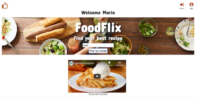
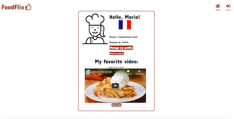
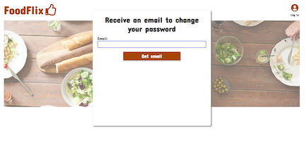

# Foodflix

This is site for finding recipes in youtube and possibility to save favorite recipe in private user-account.

**Deploying on** [infinity free](http://foodflix.rf.gd/).   
**Source code on** [github](https://marionstaats.github.io/foodflix/).

## Site page sсheme

1. Registration page for adding new user into database. Ask the user: name, e-mail, password, gender, language.


2. Login page for enter to the site existing users and possibility go to registration page or restore password.


3. Page for confirmation of exist user-email with possibility to get e-mail in user post-box with link for confirmation. Link consist id of new user and token.


4. Home page with search-bar, video of recipes, button for saving recipes and icons to user-account and log out.


5. User-account with private information about user, saving videos, icons to home-page and log-out and possibilities update your account, delete it or delete video.


6. Pages for restore password:   
6.1. Ask the user-email


6.2. Ask to create new password and confirm it.

## User stories
1. User can make registration on the site.
2. User can receive email on his post-box with link to confirm his email.
3. User can enter to the site with existing login and password
4. User can find recipe from youtube use keyword
5. User can save favorite video in his account
6. User can enter to his account and see the saving videos and his private info
7. User can change his private info (name, email, gender, language)
8. User can delete video from his account
9. User can drop his password and create new, for example, if he forgot password
10. User can delete his account


## Folder-structure
```
|
|----javascript
|    |--index.js(fetch youtube API v.3)
|    `--user.js(form for update user-account)
|
|----scss (main.scss, main.css pictures etc)
|
|----wireframe (pictures for readme)
|
|--server.php (connect with database and main logic of site)
|--errors.php (main logic for catching the errors on server)
|--index.php (home page)
|--login.php (login page)
|--registration.php (registration page)
|--user.php (user-account)
|--emailpw.php (page with ask email to restore password)
|--passwordchange.php (page with ask new password to restore password)
`--README.md
```